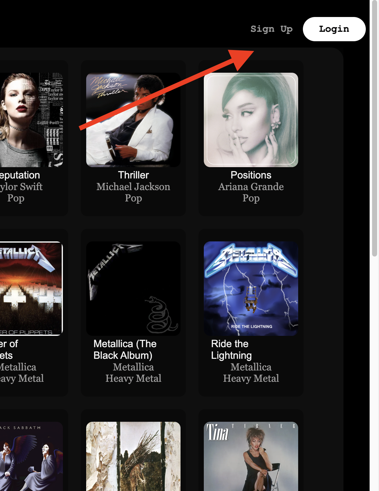

# Slotify APP
   <a href="https://slotify-web-server.onrender.com">Link to Slotify</a>

## Welcome to Slotify the mock Slotify App!
#### This application is designed to provide users with a simplified Slotify-like experience, allowing them to create, delete, update, and get playlists, view all albums on Slotify, and search for songs by genre. This README will guide you through the features and usage of the application.

## Features

### User Authentication:
<ul>
 <li>Users can create an account or log in with their existing credentials to access the application's features. </li>
</ul>

### Playlist Management:

<ul>
<li>Create a Playlist: Users can create new playlists by providing a name and an optional description. </li>
<li>Delete a Playlist: Users can delete playlists they no longer need.</li>
<li>Update a Playlist: Users can update the name and description of their existing playlists.</lo>
<li>Get a Playlist: Users can view the details of their playlists, including the songs added.</li>

<li>Get a Playlist: Users can add songs to a playlist </li>

</ul>

### Album Browsing:
<ul>
<li>View All Albums: Users can explore a list of all available albums on Slotify. These albums are provided by Slotify's API, and users can see details like the album name, artist, and cover art, as well as the songs on that album</li>
<li>Users can also search album by Genre </li>
</ul>

## Installation and Usage
<ul>Prerequisites: 

  Follow these steps to build and run the Spotify application using Docker:

1. **Prerequisites:**
   - git clone https://github.com/kmc369/Spotify.git
   cd Spotify

2. **Run:**
   - pipenv run flask run 
   cd Spotify cd react npm start

</ul>

<ul>If you're a new user:
<li> click on the "Sign Up" option to create a new account. Otherwise, log in with your existing credentials,
 or if you are visiting the site login as a Demo User</li>

</ul>

### Use the search feature to discover songs by genre. Enter a genre keyword, and the application will provide a list of matching songs.

<ul>

</ul>

## Database Schema
## Tables

## Enjoy using the Slotify Mock App, and happy music exploration!